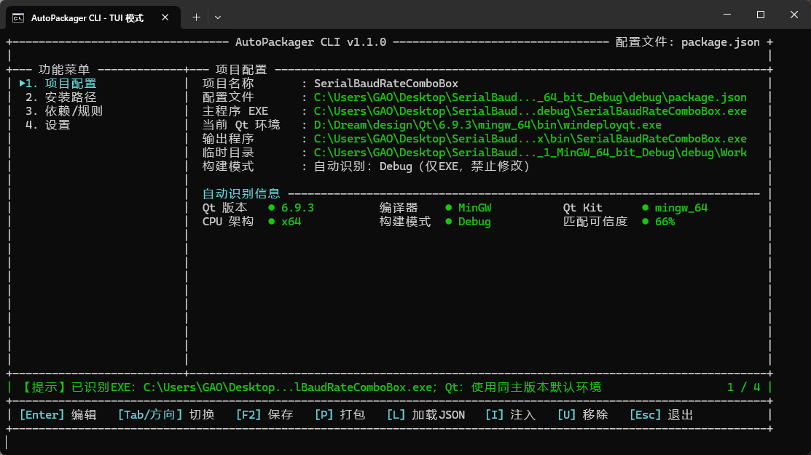
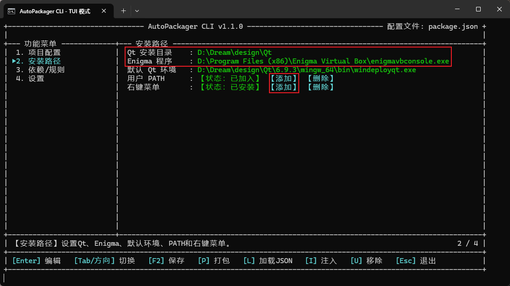
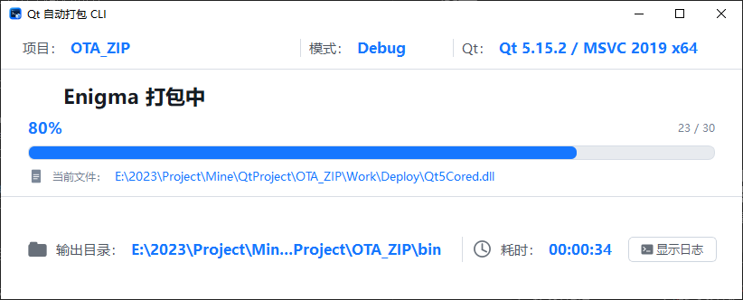

# AutoPackagerCLI
AutoPackagerCLI 是一款面向 Windows 平台的 Qt 应用自动打包工具。它可以识别 qmake（`.pro`）和 CMake（`CMakeLists.txt`）项目，调用 `windeployqt` 收集运行依赖，并通过 Enigma Virtual Box 将程序及依赖封装为单个 `.exe` 文件。



## 功能特点

- 自动识别项目目录中的 `.pro` 或 `CMakeLists.txt`。
- 支持 Debug、Release 构建产物打包。
- 自动调用 `windeployqt` 收集 Qt 运行库及插件。
- 支持通过 Enigma Virtual Box 生成单文件可执行程序。
- 支持保存项目级打包配置到 `package.json`。
- 支持向 Qt 工程注入自动打包指令。
- 支持项目目录右键快捷入口。
- 支持指定输出目录，默认输出到项目目录下的 `bin` 文件夹。

## 运行要求

- Windows 操作系统。
- 已安装 Qt 及项目所需的 Qt Kit。
- Qt 安装目录中包含 `windeployqt`。
- 已安装 Enigma Virtual Box。
- 待打包项目已在对应的 Debug 或 Release 模式下成功生成可执行文件。

## 首次设置

双击 `AutoPackagerCLI.exe`，完成以下设置：

1. 设置 Qt 安装路径。
2. 设置 Enigma Virtual Box 安装路径。
3. 根据界面提示，将 AutoPackagerCLI 添加到用户 `PATH` 环境变量（选择“添加”后按回车确认）。
4. 可选：添加项目目录右键快捷菜单。



设置路径会自动保存，后续启动无需重复配置。`F2` 仅用于保存当前项目的打包参数，并不是保存全局安装路径。

## 快速开始

### 自动识别并打包 Qt 项目

1. 先使用 Qt Creator 在需要的 Debug 或 Release 模式下构建项目。
2. 在 `.pro` 或 `CMakeLists.txt` 所在的项目目录中启动 AutoPackagerCLI：
   - 使用已添加的右键快捷菜单；或
   - 在命令行切换到该目录后执行 `AutoPackagerCLI.exe`。
3. 工具检测到项目文件后，会自动识别项目并填充打包参数。
4. 检查构建模式和输出目录：
   - Debug：打包 Debug 构建产物；
   - Release：打包 Release 构建产物；
   - 输出目录默认为项目目录下的 `bin`，可按需修改。
5. 按 `F2` 保存配置。工具会在项目目录中生成 `package.json`。
6. 按 `P` 立即执行一次打包。



### 注入工程并在构建后自动打包

完成项目识别和参数设置后：

1. 按 `F2` 生成或更新 `package.json`。
2. 按 `I` 将自动打包指令注入工程。
3. 关闭 AutoPackagerCLI 窗口，并在 Qt Creator 中重新加载工程（如 Qt Creator 提示工程文件已变化）。
4. 点击“构建”或“重新构建”。当目标程序发生重新链接并成功生成后，AutoPackagerCLI 会自动执行打包。

> **重要：普通“构建”不等于每次都会打包。** 当前工程注入方式属于构建后触发：只有构建系统实际重新链接并生成目标程序时，自动打包指令才会执行。如果源码和工程均未变化，构建系统可能直接报告目标已是最新状态，此时不会重新链接，也不会执行自动打包。

常见情况如下：

| Qt Creator 操作 | 项目状态 | 是否自动打包 |
| --- | --- | --- |
| 构建 | 源码或工程有修改，并触发重新链接 | 是 |
| 构建 | 无任何修改，目标已是最新 | 否 |
| 重新构建项目 | 重新编译并重新链接成功 | 是 |
| 在工具中按 `P` | 已存在可用的构建产物 | 立即打包 |

如果项目没有修改，但仍需重新生成安装包，可选择以下任一方式：

- 在 AutoPackagerCLI 中按 `P` 手动打包；
- 在 Qt Creator 中执行“重新构建项目”；
- 在 Qt Creator 的 Build Steps 中另行添加 AutoPackagerCLI 自定义步骤，以实现每次点击“构建”都执行。Build Steps 属于当前用户和 Kit 的 Qt Creator 配置，不会随项目构建文件稳定地共享给其他开发者。

### 手动打包已有可执行文件

1. 确认待打包的 `.exe` 已成功构建。
2. 在该 `.exe` 所在目录中，通过右键快捷菜单启动 AutoPackagerCLI；也可以在命令行切换到该目录后执行 `AutoPackagerCLI.exe`。
3. 设置构建模式、输入文件、输出目录及其他打包参数。
4. 按 `F2` 保存当前打包配置。
5. 按 `P` 执行打包。

## 配置与构建模式

项目配置保存在项目目录下的 `package.json` 中。首次保存后，可以直接编辑该文件调整输出目录、构建模式等参数。

自动打包时，AutoPackagerCLI 的构建模式必须与 Qt Creator 当前使用的构建模式一致。例如，配置为 Release 时，应先使用 Release Kit 构建目标程序；仅执行 Debug 构建不会触发该 Release 打包配置。

这项限制也可以用于日常开发：平时使用 Debug 模式调试，需要发布时切换到 Release 模式并构建。

## Qt 环境说明

### Qt 安装路径、默认环境和当前环境的区别

AutoPackagerCLI 中与 Qt 有关的路径分为三个概念：

| 名称 | 示例 | 用途 |
| --- | --- | --- |
| Qt 安装路径 | `D:\Qt` | Qt 的总安装目录，用于扫描其中已经安装的各个 Qt Kit。不要填写某个项目的构建目录。 |
| 默认 Qt 环境 | `D:\Qt\6.11.1\mingw_64\bin\windeployqt.exe` | 全局备用环境。无法从目标程序准确确定小版本时，优先选择与程序主版本兼容的默认环境。 |
| 当前 Qt 环境 | 项目配置页显示的 `windeployqt.exe` | 本次打包实际调用的环境。它可能由程序自动匹配，也可以由用户手动选择。 |

`windeployqt.exe` 必须具体到可执行文件，不能只填写 `bin` 目录或 Kit 目录。一个典型的完整路径如下：

```text
D:\Qt\6.11.1\mingw_64\bin\windeployqt.exe
```

### 环境扫描与自动匹配顺序

设置 Qt 安装路径后，程序会扫描其中可用的 `windeployqt.exe`。进入 TUI 的 Qt 环境选择页，或执行 `env list`、`env set` 时，会主动重新扫描，确保列表反映当前安装状态。

选择主程序后，程序按以下顺序匹配环境：

1. 优先从 EXE 所在构建路径中的 Qt Kit 名称判断环境，例如 `Desktop_Qt_6_11_1_MinGW_64_bit_Release`。
2. 路径信息不足或无法匹配时，读取 EXE 的 Qt 依赖、CPU 架构和编译器 ABI 进行匹配。
3. 无法确定 Qt 小版本，但程序主版本与默认环境一致时，优先采用兼容的同主版本默认环境。
4. 仍无法自动确定时，使用已经设置且兼容的默认环境；没有兼容环境则提示用户手动选择。

手动选择 EXE 后会重新执行上述匹配。项目配置页中的“当前 Qt 环境”才是打包时实际使用的 `windeployqt.exe`，请在开始打包前核对。

### 兼容性要求

Qt 环境至少应与目标程序满足以下条件：

- Qt 主版本一致，例如 Qt 5 程序不能使用 Qt 6 的 `windeployqt`。
- CPU 架构一致，例如 x64 程序不能使用 x86 Kit。
- 编译器 ABI 一致，例如 MinGW 构建的程序不能使用 MSVC Kit。
- Debug、Release 构建模式与当前打包配置一致；Debug 程序还需要对应 Kit 提供 Debug 运行库。

最稳妥的做法是选择构建该 EXE 时使用的同一个 Qt Kit。项目中安装了多个 Qt 版本或多个编译器 Kit 时，不建议只依赖系统 `PATH` 中的 `windeployqt`。

### 匹配可信度

项目配置页会显示 Qt 版本、编译器、Qt Kit、CPU 架构、构建模式和“匹配可信度”。可信度用于表示当前 EXE 信息与候选 Qt 环境的匹配程度：

- 可信度较高：版本、架构、编译器以及路径 Kit 信息较完整。
- 可信度不是 100%：通常表示 EXE 中缺少可读取的小版本或编译器版本信息，程序使用了依赖信息或默认环境完成匹配。
- 显示 `--`：尚未设置有效 EXE，或当前没有匹配到兼容环境。

可信度仅用于辅助判断，不代替实际打包验证。只要 Qt 主版本、架构或编译器 ABI 不一致，就应重新选择环境。

### 在 TUI 或命令行中设置 Qt 环境

在 TUI 中进入“安装路径”页面，可以设置 Qt 安装路径和默认 Qt 环境；在“项目配置”页面进入“当前 Qt 环境”，会列出重新扫描得到的 Qt Kit 供选择。

也可以使用命令行：

```bat
AutoPackagerCLI.exe settings set --qt-root "D:\Qt"
AutoPackagerCLI.exe env list
AutoPackagerCLI.exe env set --index 1
```

`env list` 会显示本次扫描到的环境及编号，`env set --index N` 将指定编号的 `windeployqt.exe` 保存为默认环境。路径中含有空格时必须使用英文双引号包围完整路径。

## 常见问题

### 点击“构建”后为什么没有自动打包？

依次检查：

1. 是否已经按 `F2` 生成 `package.json`。
2. 是否已经按 `I` 完成工程注入。
3. Qt Creator 当前构建模式是否与打包配置一致。
4. 本次构建是否实际发生了重新链接。若提示目标已是最新状态，请按 `P` 手动打包或执行“重新构建项目”。
5. Qt、`windeployqt` 和 Enigma Virtual Box 的安装路径是否正确。

### 为什么普通“构建”和“重新构建”的结果不同？

普通“构建”采用增量构建：没有文件变化时可能不执行编译和链接。工程注入的自动打包指令随链接动作执行，因此也不会触发。

“重新构建项目”会重新生成目标程序，链接完成后会执行自动打包，但所需时间也更长。

### 如何做到每次点击“构建”都执行打包？

可以在 Qt Creator 的 Build Steps 中添加一个额外的自定义步骤来运行 AutoPackagerCLI。即使前一个构建步骤没有产生新文件，额外步骤仍会执行。

需要注意，Build Steps 通常保存在 Qt Creator 的用户级项目配置中，并与具体 Kit 关联。更换电脑、用户或 Kit 后可能需要重新配置，因此不建议把它视为可随项目共享的标准工程配置。

### 为什么扫描不到 Qt 环境？

依次检查：

1. Qt 安装路径是否填写为总目录，例如 `D:\Qt`，而不是项目构建目录。
2. 对应 Kit 的 `bin` 目录中是否存在 `windeployqt.exe`。
3. Qt Maintenance Tool 中是否已经安装项目所需的 Desktop Kit，而不只是 Qt Creator。
4. 设置路径后是否重新进入 Qt 环境选择页，或执行 `env list` 触发重新扫描。
5. 当前用户是否有权访问 Qt 安装目录。

如果使用了非标准目录，可以先把其 Qt 根目录设置为安装路径，再重新扫描。不要把项目自己的 `build`、`release` 或 `bin` 目录当作 Qt 安装路径。

### 为什么已经设置默认 Qt 环境，项目仍选择了另一个环境？

默认环境是自动识别失败时的备用项，不会覆盖更可靠的项目匹配结果。程序能够从 EXE 构建路径或依赖中识别出具体 Qt Kit 时，会优先使用识别结果。

如果必须使用指定环境，请在项目配置页手动选择“当前 Qt 环境”，然后按 `F2` 保存到当前项目的 `package.json`。

### 为什么匹配可信度不是 100%？

发布后的 EXE 不一定包含完整的 Qt 小版本、编译器版本或 Kit 名称。程序仍可能根据 Qt 主版本、CPU 架构、编译器 ABI 和默认环境找到兼容项，因此可信度可能低于 100%。

请重点核对项目配置页显示的 Qt 版本、编译器、Qt Kit 和 CPU 架构。如果这些信息与实际构建环境一致，通常可以继续打包；若主版本、架构或编译器不同，应手动更换环境。

### 为什么项目文件已经识别，但主程序 EXE 仍显示未设置？

识别到 `.pro` 或 `CMakeLists.txt` 只表示项目结构有效，不代表目标程序已经构建。请先在 Qt Creator 中使用目标 Debug 或 Release 模式完成构建。

如果 EXE 位于程序未识别到的自定义构建目录，可以在项目配置页手动设置主程序路径。设置后程序会再次识别构建模式并重新匹配 Qt 环境。

### 为什么 `windeployqt` 执行失败或提示环境不匹配？

常见原因包括：

- 选择了错误的 Qt 主版本、CPU 架构或编译器 Kit。
- Debug 程序使用了 Release 配置，或当前 Kit 缺少 Debug 运行库。
- 主程序尚未成功构建，或者 EXE 路径已经失效。
- 程序依赖的第三方 DLL 不在 EXE 目录、依赖搜索路径或系统 `PATH` 中。

请先在项目配置页核对“主程序 EXE”“当前 Qt 环境”和“构建模式”。CLI 带进度窗口运行时，失败窗口会保留错误信息；点击确定后窗口关闭，并以原错误码退出。

### 为什么修改 PATH 后当前 CMD 仍找不到 AutoPackagerCLI？

已经打开的 CMD 或 Windows Terminal 不会自动刷新环境变量。添加用户 `PATH` 后，请关闭原终端并重新打开，再执行：

```bat
AutoPackagerCLI.exe --help
```

如果仍无法找到程序，请在“安装路径”页面检查用户 `PATH` 状态，并确认加入的是 `AutoPackagerCLI.exe` 所在目录，而不是可执行文件本身。

### 命令中的路径包含空格时为什么会报参数错误？

CMD 会把空格视为参数分隔符，必须使用英文双引号包围完整路径。例如：

```bat
AutoPackagerCLI.exe settings set --qt-root "D:\Qt" --enigma "D:\Program Files (x86)\Enigma Virtual Box\enigmavbconsole.exe"
```

不要省略引号，也不要只给路径的一部分加引号。

## 使用注意事项

- 修改 `package.json` 后，请确认其中的构建模式、输入文件和输出目录仍与当前工程一致。
- 自动打包依赖目标程序成功生成；编译或链接失败时不会得到有效的打包结果。
- 注入工程文件后，如果 Qt Creator 检测到外部修改，请选择重新加载工程。
- 项目包含多个 Kit 或多个构建目录时，应确认当前使用的是目标打包配置对应的构建目录。
- 当前版本仅支持 Windows 平台。
